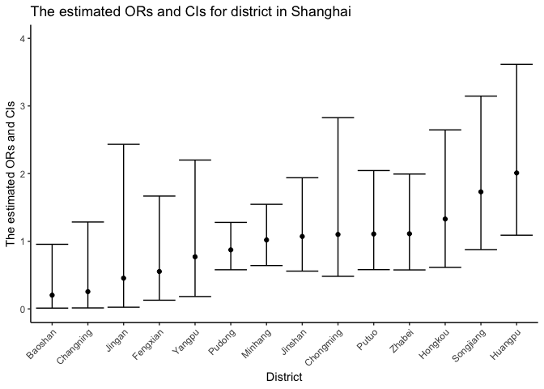
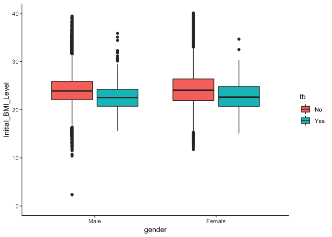

The Incidence Rate of Tuberculosis among People with Type II Diabetes in Shanghai, China
================
Rui Huang (rh2916) Hanbo Qiu (hq2163) Annie Yu (xy2404) Dana Zeng (dz2399) Coco Zou (xz2809)

Motivation
----------

Due to rapid urbanizations and lifestyles, type 2 diabetes (T2D) has become one of the most concerning public health issues in China. People with T2D are at risk of multiple complications including blindness, cardiovascular diseases, and becoming more susceptible to infectious diseases. As a result, researchers began to notice a higher tuberculosis (TB) incidence in the T2D positive population. Therefore, we would like to explore the association between TB and T2D and what potential risk factors contribute to this comorbidity, and hopefully, provide recommendations to control or decrease the prevalence of T2D and TB in China.

Related work
------------

We referred to a paper which conducted a retrospective cohort study in Shanghai, China. (Qiu, Shi et al. 2017) It calculated the incident rate and risk factors for tuberculosis among patients with type 2 diabetes. We explored some variables which have proved to be related to the risk of tuberculosis based on this paper. Moreover, we browsed WHO website to collect the statistics about diabetes and tuberculosis and the End TB strategy. In data science class, we learned lectures about data wrangling, build website and shiny. We all spared no efforts to apply these coding into our website.

Initial Questions
-----------------

The planned questions include what’s the incident rate of TB and its associates among adults with type 2 diabetes in Shanghai, China between 2004-2014, and geographical distribution of TB infection among these specific populations. We intend to explore which variables might affect the TB incidence in people with type 2 diabetes. The potential factors would conclude gender, sociodemographic factor (i.e. age at diagnosis of T2D), clinical parameters (BMI, fasting glucose), complications of T2D, choice of antidiabetic medication, mode of exercises and geographical location. Most of these questions were answered in our project. Over the course of the project, we found it’s necessary to further analyze their interaction, like analyzing exercises distribution and glucose management odds ratios in different districts. Also, we come up with a new question that we might further explore the multilevel analysis on TB cases if more data is accessible. For example, we can analyze the individual, street and district levels respectively to check whether there is any difference in influencing the number of TB cases.

Data Source and Data Cleaning
-----------------------------

``` r
load('./dm.Rdata')
df_raw = dm_base %>%   
  rename(subject_id = JiBenCID,  
         weight = tizhong,  
         height = ShenGao,  
         exercise_time = xiuxiansj) %>%   
  mutate(gender = ifelse(xingbie == 1, "Male", "Female"),  
         tb = ifelse(censer == 1, "No", "Yes"),  
         exercise = as.factor(xiuxiantl)) %>%   
  select(-xingbie, -censer, -xiuxiantl) %>%   
  janitor::clean_names()  
  
levels(df_raw$exercise) <- list("Mild" = 1,  "Medium" = 2,'heavy'=c(3,4))
```

``` r
df_combine = dm_base %>% 
  rename(
    subject_id = JiBenCID,
    glu_average = fastglu, 
    weight_initial = tizhong_1st, 
    weight_average = tizhong, 
    height = ShenGao, 
    glu_initial = kfxt_1st,
    gender = xingbie,
    district = GuanLiQX,
    sys_pressure = Sbp,
    dia_pressure = Dbp,
    exercise_time = xiuxiansj,
    exercise = xiuxiantl,
    drug_insulin = insulin,
    drug_oral_sulfo = sulfonylurea,
    drug_oral_biguanide = biguanide,
    drug_oral_glu = glu_inhib,
    retina = reti, 
    skin = derm, 
    vessel = vesl, 
    nerve = neur,
    kidney = neph, 
    depression = depress,
    dmtime = quezhensj,
    birthyear  = birth_year,
    birthmon = birth_mon,
    dmdatayear = rucu_year,
    dmdatamon = rucu_mon,
    dmdataage = rucuage,
    drug_order = fuyaoqk) %>% 
  mutate(
    gender = factor(gender, labels = c("Male", "Female")),
    district = as.factor(district),
    glu_self_monitor = as.factor(celiangxtgl),
    bmi_initial = weight_initial/(height/100)^2, 
    bmi_average = weight_average/(height/100)^2, 
    bmi_change = bmi_average - bmi_initial,
    glu_change = glu_average - glu_initial,
    tb = as.factor(ifelse(censer == 1, "No", "Yes")),
    exercise = as.factor(exercise),
    drug_oral_name  = case_when(drug_oral_sulfo == "1" & drug_oral_biguanide == "0" & drug_oral_glu == "0" ~"sulfonylurea",
                           drug_oral_biguanide == "1" & drug_oral_sulfo == "0" & drug_oral_glu == "0" ~ "biguanide",
                           drug_oral_glu == "1" & drug_oral_biguanide == "0" & drug_oral_sulfo == "0" ~ "glu_inhib",
                           drug_oral_sulfo == "1" & drug_oral_biguanide == "1" & drug_oral_glu == "0" ~"sulfonylurea&biguanide",
                           drug_oral_biguanide == "1" & drug_oral_sulfo == "0" & drug_oral_glu == "1" ~ "biguanide&glu_inhib",
                           drug_oral_sulfo == "1" & drug_oral_biguanide == "0" & drug_oral_glu == "1" ~"sulfonylurea&glu_inhib",
                           drug_oral_sulfo == "1" & drug_oral_biguanide == "1" & drug_oral_glu == "1" ~"sulfonylurea&glu_inhib&biguanide",
                           TRUE ~ "NA"),
    drug = drug_oral_biguanide + drug_oral_biguanide + drug_oral_glu + drug_insulin,
    retina = as.numeric(retina),
    skin = as.numeric(skin),
    vessel = as.numeric(vessel),
    nerve = as.numeric(nerve),
    kidney = as.numeric(kidney),
    complications = retina + skin + vessel + nerve + kidney + depression,
    complications = as.factor(complications),
    drug_order = as.factor(drug_order)
  ) %>% 
  select( -`_COL19`, -ZhiYe, -GuanLiJD, -ZhuZhiQX, -ZhuZhiJD, -JianCaQX, -JianCaJD)


levels(df_combine$exercise) <- list('1' = 1,  '2' = 2, '3' = c(3,4))

levels(df_combine$district) <- list("Huangpu" = 310101, "Xuhui" = 310104, "Changning" = 310105, "Jingan" = 310106, "Putuo" = 310107, "Zhabei" = 310108, "Hongkou" = 310109, "Yangpu" = 310110, "Minhang" = 310112, "Baoshan" = 310113,  "Pudong" = c(310115, 10119), "Jiading" = 310114, "Jinshan" = 310116, "Songjiang" = 310117, "Qingpu" = 310118, "Fengxian" = 310120, "Chongming" = 310230)

levels(df_combine$glu_self_monitor) <- list("Yes" = 1, "No" = 2:3)

save(df_combine,file = './data/df_combine.RData')
```

Exploratory analysis
--------------------

After the first step of analysis of the data set, we decided to mainly focus on four main risk factors: glucose level, drug usage level, complications level, and daily exercise level. When doing the analysis, for each risk factors, we looked for the different distributions of different levels by gender, by district, and by age. Because we are investigating the incidence of tuberculosis among Type II diabetes patients, we also analyzed the odds of tuberculosis in different levels of risk factors. We have explored histograms, density plot and odds ratio comparing plot to analyze different distributions. Our final result is shown in the K-M survival plot, which will be discussed later.

### Descriptive Statistics

``` r
df_descrip = df_combine %>% 
  filter(district != "") %>% 
  mutate(tb = fct_recode(tb, '1'= 'Yes', '0'='No')) %>% 
  mutate(tb=as.character(tb),
         tb=as.numeric(tb)) 

# person_years
summary(df_descrip$days)
```

    ##    Min. 1st Qu.  Median    Mean 3rd Qu.    Max. 
    ##       0     638    1485    1403    1970    4001

``` r
mean_follow_up_year = mean(df_descrip$days)/365
sum_follow_up_year = sum(df_descrip$days)/365

# tb summary
summary(df_descrip$tb)
```

    ##     Min.  1st Qu.   Median     Mean  3rd Qu.     Max. 
    ## 0.000000 0.000000 0.000000 0.004607 0.000000 1.000000

``` r
sum_tb = sum(df_descrip$tb)

# all participants
nrow(df_descrip)
```

    ## [1] 170377

``` r
# overall incidence
overall_incidence = sum_tb/sum_follow_up_year

# male incidence
df_male = df_descrip %>% filter(gender == 'Male')
male_incidence = sum(df_male$tb)/(sum(df_male$days)/365)

# female incidence
df_female = df_descrip %>% filter(gender == 'Female')
female_incidence = sum(df_female$tb)/(sum(df_female$days)/365)
```

With an average following-up period of 3.8441142 year (range: 0 to 10.9616438 years, 785 TB cases were recorded among 170377 T2DM patients from 6.549486510^{5} person-years follow-up. The overall incident rate of TB was 119.8567243 per 100 000 person-years with 224.2070137 per 100 000 person-years for men, and 51.3446843 per 100 000 person-years for women.

### Glucose Management

``` r
df_combine %>% 
  mutate(urban_rural = as.factor(urban_rural)) %>% 
  filter(!is.na(district), !district %in% c("Xuhui", "Qingpu", "Jiading")) %>% 
  group_by(district) %>% 
  nest() %>% 
  mutate(models = map(data, ~glm(tb ~ gender + dmage + glu_self_monitor, data = .x, family = binomial())),
         ci = map(.x=models, ~confint(.x)),
         or = map(models, broom::tidy),
         ci = map(ci, broom::tidy)) %>% 
  select(-data,-models) %>% 
  unnest() %>% 
  filter(term == "glu_self_monitorNo") %>% 
  select(district, or = estimate, ci_low = "X2.5..", ci_high = "X97.5..") %>% 
  mutate(or = exp(or), ci_low = exp(ci_low), ci_high = exp(ci_high), district = fct_reorder(district, or)) %>% 
  ggplot(aes(x = district, y = or)) + 
  geom_point() + 
  geom_errorbar(aes(ymin = ci_low, ymax = ci_high)) +
  labs(
    title = "The estimated ORs and CIs for district in Shanghai",
    x = "District",
    y = "The estimated ORs and CIs"
  ) +
  theme(axis.text.x = element_text(angle = 45, hjust = 1)) +
  scale_y_continuous(limits=c(0, 4))
```



We explored whether diabetes who regularly monitor glucose can reduce the risk of having TB in urban or rural areas. After obtaining the estimate and confidence interval of the adjusted odds ratio for having TB comparing diabetes who regularly monitor glucose to those who don't do in urban or rural area are similar. For each district in Shanghai, we obtained the estimate and confidence interval of the adjusted odds ratio for having TB comparing diabetes who regularly monitor glucose to those who don't monitor glucose regularly keeping all other variables fixed. The results show Huangpu district has the highest OR and Baoshan district has the lowest OR.

### BMI

``` r
df_combine %>% 
  ggplot(aes(x = gender, y = bmi_initial, fill = tb)) +
  geom_boxplot() +
  scale_y_continuous(limits=c(0, 40))
```



We found median and quartiles are higher in non-tb patients than in tb.

### Drug Usage level

``` r
df_drug = df_combine %>% 
  select(contains("drug"),censer,urban_rural,dmage,gender) 


drug_model = df_drug %>% 
  group_by(drug_order) %>% 
  nest() %>% 
  mutate(models = map(data, ~glm(censer ~ drug, data = .x, family = binomial())),
         ci = map(models,confint),
         ci = map(ci,broom::tidy),
         models = map(models, broom::tidy)) %>% 
  select(-data) %>% 
  unnest() %>% 
  mutate(low_bond = exp(X2.5..),
         high_bond = exp(X97.5..),
         OR = exp(estimate)) %>% 
  select(drug_order,term,estimate,low_bond,high_bond,OR)
```

``` r
plot_names_2 <- c("1" = "Urban", "2" = "Rural")

p2 <- df_drug %>% 
  ggplot(aes(x = drug))+geom_histogram(color="black", fill="blue")+
  facet_grid(~factor(urban_rural), labeller = as_labeller(plot_names_2)) + 
  viridis::scale_fill_viridis(discrete = TRUE)+
  theme_classic()+
  labs(
    x = "Drug Level"
  )

p2
```


In the drug part analysis, we first analyze the drug usage distribution in different districts, different ages, and different genders. It turns out that by gender and by district, there are no significant changes. Furthermore, between different genders, males are more likely to have diabetes and taking more than two kinds of drugs, including insulin and oral drugs. The 95% percent confidence of odds of tuberculosis in different drugs levels overlap with each, which means that there is no significant difference in odds of tuberculosis in people who are taking different amounts of drugs.

### Complications Level

``` r
df_complication <- df_combine %>% 
  mutate(retina = as.numeric(retina),
         skin = as.numeric(skin),
         vessel = as.numeric(vessel),
         nerve = as.numeric(nerve),
         kidney = as.numeric(kidney)) %>% 
  mutate(complications = retina + skin + vessel + nerve + kidney + depression) %>%
  mutate(complications = as.character(complications),
         complications = fct_collapse(complications, none='0',one='1',more_than_two= as.character(c(2:6))))
  

df_com<- df_complication %>% 
  group_by(complications) %>% 
  summarise(Frequency = n())
```

``` r
plot_com2<-ggplot(df_com, aes(x = complications, y = Frequency, fill=complications)) +
    geom_histogram(stat = "identity", width = .6) +
    labs(title="The Frequency of complications",
          x = "How many complications for diabetes patients",
           y = "Frequency") +
    theme(axis.title.x =  element_blank(),
          axis.text.x  =  element_blank(), 
          axis.title.y = element_text(face="bold", size=12),
          axis.text.y  = element_text(angle=0, vjust=0.5, size=10),
          legend.title = element_text(size=12, face="bold"),
          legend.text = element_text(size = 12, face = "bold"))
plot_com2
```


### Daily Exercise Level

``` r
df_exercise = df_combine %>% 
  mutate(exercise = as.numeric(exercise),
         total_exercise = exercise * exercise_time,
         gender = as.factor(gender))
```

``` r
plot_exer = ggplot(df_exercise, aes(x = dmage, y =total_exercise, colour=dmage)) +
    geom_histogram(stat = "identity", width = .6) +
    labs(title="The average exercise vs age",
         x = "age") +facet_wrap(~gender)
plot_exer
```


We compare the average exercise level between gender, age distribution and TB status and find that the average exercise level for females is slightly higher than male. Exercise level is highest in Nanhui District. As age increases, the average exercise level increases first then decreases. From the boxplot, participants who develop TB have slightly lower average exercise level than those who did not develop TB, however, it cannot be represented in the K-M curve.

### District Analysis

The map is showed by shiny, which can be reached by <https://danazenggg-p8105.shinyapps.io/geo_analysis_goodtogo/>.

The code we use is here:

``` r
# Converting shapefiles to data frame 
sh <- readOGR('data/shanghai_shapefile/shang_dis_merged.shp',verbose = F)
sh@data <- sh@data %>% 
  mutate(Name = as.factor(Name)) %>%
  mutate(Name = fct_recode(Name, Jiading = '嘉定区',
                           Fengxian = '奉贤区',
                           Baoshan = '宝山区',
                           Chongming = '崇明县',
                           Xuhui = '徐汇区',
                           Putuo ='普陀区',
                           Yangpu = '杨浦区',
                           Songjiang = '松江区',
                           Pudong='浦东新区',
                           Hongkou = '虹口区',
                           Jinshan = '金山区',
                           Changning = '长宁区',
                           Minhang = '闵行区',
                           Zhabei = '闸北区',
                           Qingpu = '青浦区', 
                           Huangpu = '黄浦区'))
sh_df <- broom::tidy(sh, region='Name')
sh_df <- sh_df %>%
  mutate(urban = as.factor(id))%>% 
  mutate(urban = fct_collapse(urban, 
                              Urban = c('Changning','Hongkou','Huangpu','Putuo','Xuhui','Yangpu','Zhabei'),
                              Suburban =  c('Baoshan','Jiading','Jinshan','Minhang','Chongming','Qingpu','Songjiang','Fengxian'),
                              Pudong__New_District = 'Pudong'))
x <- df_combine %>% 
  filter(district != "") %>% 
  mutate(tb = fct_recode(tb, '1'= 'Yes', '0'='No'),
         tb=as.character(tb),
         tb=as.numeric(tb),
         district = as.character(district),
         district = fct_collapse(district, Huangpu = '310101', Xuhui = '310104', Changning = c('310105', '310106'), Putuo = '310107', Zhabei = '310108', Hongkou = '310109', Yangpu = '310110', Minhang = '310112', Baoshan = '310113',  Pudong = c('310115', '310119'), Jiading = '310114', Jinshan = '310116', Songjiang = '310117', Qingpu = '310118', Fengxian = '310120', Chongming = '310230'),
         exercise = as.numeric(as.character(exercise)),
         complications = as.numeric(as.character(complications)))%>% 
  group_by(district) %>% 
  summarise(TB_Total = sum(tb),
            TB_Incidence = TB_Total/n(),
            Exercise_Frequency = mean(exercise),
            Complications = mean(complications),
            BMI_Change = mean(bmi_change,na.rm = T),
            Glucose_Average = mean(glu_average),
            Glucose_Measure_Frequency = mean(celiangxtgl),
            Medication = mean(drug)) %>% 
  rename(id = district)

sh_df <- sh_df %>% 
  inner_join(x,by='id') %>% 
  gather(TB_Total:Medication, key=parameter, value=value)

write.csv(sh_df,'data/sh_df.csv')
```

``` r
# Administrative Map of Shanghai
sh_df <- read.csv('data/sh_df.csv')
map1 <- sh_df %>%
      rename(District = id) %>%
      filter(parameter=='TB_Total') %>%
      ggplot()+
      geom_polygon(aes(x = long, y = lat, group = group,fill=District),alpha=.5,
                   colour = "black")+
      scale_alpha_manual( guide = "none")+
      theme_bw()+
      facet_wrap(~'District' )
map2 <- sh_df %>%
      filter(parameter=='TB_Total') %>%
      mutate(urban = fct_recode(urban, City = 'Urban', Suburb = 'Suburban', Pudong = 'Pudong__New_District')) %>% 
      rename(City_or_Suburb = urban) %>%
      ggplot()+
      geom_polygon(aes(x = long, y = lat, group = group,fill=City_or_Suburb),alpha=.5,
                   colour = "black")+
      scale_alpha_manual( guide = "none")+
      theme_bw()+
      facet_wrap(~'City/Suburb' )

maps <- subplot(style(map1, showlegend = FALSE),style(map2, showlegend = F),
                margin = 0.05,titleX = F,titleY = F)
maps
```

``` r
# Geo Analytics for Different Parameters
choice=  sh_df %>% distinct(parameter) %>% pull()

 sidebarLayout(

     sidebarPanel(
       inputPanel(radioButtons("Parameter", label = h3("Parameters"),
                 choices = choice, selected = "TB_Total")
 )

     ),

     # Show a plot of the generated distribution
     mainPanel(
       renderPlotly({
     map <- sh_df%>%
       rename(District = id) %>%
       filter(parameter == input$Parameter) %>%
       ggplot()+
       theme_bw()+
       geom_polygon(aes(x = long, y = lat, group = group,fill=value),alpha = .5,
                    colour = "black")
     ggplotly(map)
       }
     )
   )
 )
```

Additional analysis
-------------------

### Cox Regression

``` r
df_cox <- df_combine %>% 
  mutate(age = 2018-as.numeric(birthyear)) %>% 
  mutate(complications = as.numeric(complications)) %>% 
  mutate(exercise = as.numeric(exercise))

cox <- coxph(Surv(days, censer) ~ complications+gender+exercise+age+drug, data =df_cox)
```

##### The global test statistic is given by:

``` r
broom::glance(cox) %>%
  select(statistic.log,p.value.log,statistic.sc,p.value.sc,statistic.wald,p.value.wald,r.squared) %>% 
  knitr::kable(digits = 3)
```

|  statistic.log|  p.value.log|  statistic.sc|  p.value.sc|  statistic.wald|  p.value.wald|  r.squared|
|--------------:|------------:|-------------:|-----------:|---------------:|-------------:|----------:|
|       4901.174|            0|      4775.888|           0|         4769.39|             0|      0.028|

##### The summary of Cox Regression

``` r
broom::tidy(cox) %>% 
  mutate(exp_estimate = exp(estimate)) %>% 
  select(term,exp_estimate, std.error, statistic, p.value) %>% 
knitr::kable(digits = 3)
```

| term          |  exp\_estimate|  std.error|  statistic|  p.value|
|:--------------|--------------:|----------:|----------:|--------:|
| complications |          0.821|      0.005|    -37.852|    0.000|
| genderFemale  |          0.919|      0.005|    -17.172|    0.000|
| exercise      |          0.818|      0.005|    -37.195|    0.000|
| age           |          0.999|      0.000|     -2.226|    0.026|
| drug          |          0.909|      0.002|    -40.007|    0.000|

We fitted the Cox regression with covariates of complications, exercise, age, drug, complications, and gender. The p-value for all three overall tests (likelihood, Wald, and score) are significant, indicating that the model is significant. These tests evaluate the omnibus null hypothesis that all of the betas are 0, and therefore the omnibus null hypothesis is soundly rejected.

In the multivariate Cox analysis, the all covariates remain significant (p &lt; 0.05). The p-value for exercise is less than 2e-16, with a hazard ratio HR = exp(coef) = 0.818, indicating a relationship between the exercise status and decreased risk of death. When holding the other covariates constant, exercising more than 2 hours a week (exercise=3) reduces the hazard by nearly 20%. We conclude that exercising more than 2 hours a week is associated with good prognostic. The p-value for gender is less than 2e-16, with a hazard ratio HR = exp(coef) = 0.919, indicating a relationship between the patients’ sex and decreased risk of death. When holding the other covariates constant, being female (sex=2) reduces the hazard by nearly 8%. We conclude that being female is associated with good prognostic. The p-value for the drug is less than 2e-16, with a hazard ratio HR = exp(coef) = 0.909, indicating a relationship between the number of antidiabetic drugs that the patient takes and decreased risk of death. When holding the other covariates constant, taking four antidiabetic medications (drug=4) reduces the hazard by nearly 10%. We conclude that taking antidiabetic medication is associated with good prognostic.

### Survival Analysis

To further visualize how different risk factors affect the time of getting TB among T2DM people, we used Kaplan-Meier estimator to estimate the survival function and drew Kaplan–Meier survival curves. In this function, the event is developing TB. From the curve, gender and drug have effects on the probability of getting TB while exercise and complication have no significant effect.

The result is showed by shiny, which can be reached by <https://dmvstb.shinyapps.io/survivalanalysis/>.

The code is here:

``` r
df_combine$survival = with(df_combine, Surv(days, tb == "Yes"))

df_combine <- df_combine %>% 
  head(10)

risk_vectors <- c("drug","gender")
district_vectors <- c("A","B","C")


# Define UI for application that draws a histogram
ui <- fluidPage(
   
   # Application title
   titlePanel("K-M analysis"),
   sidebarPanel(
     selectInput("risk_factor", label = h3("Risk Factors"),
                 choices = risk_vectors, selected = "Manhattan"),
     
     selectInput("district_vector", label = h3("Select District"),
                 choices = district_vectors, selected = "A")
   ),
   mainPanel(
     plotOutput('plot1')
   )
   
)

# Define server logic required to draw a histogram
server <- function(input, output) {
  output$plot1 <- renderPlot(
    if(input$risk_factor=="gender"){
      km =  survfit(survival ~ gender, data = df_combine, conf.type = "log-log")
      ggsurvplot(km, 
                 data = df_combine, 
                 risk.table = F, 
                 pval = T, 
                 ylab = paste0("o","1"), 
                 ylim = c(0.9, 1.0))
    }else{
      km =  survfit(survival ~ drug, data = df_combine, conf.type = "log-log")
      ggsurvplot(km, 
                 data = df_combine, 
                 risk.table = F, 
                 pval = T, 
                 ylab = paste0("o","1"), 
                 ylim = c(0.9, 1.0))
    }
  )
}

# Run the application 
shinyApp(ui = ui, server = server)
```

Conclusion:
-----------

Our result indicates that males with Type II Diabetes are more likely to have tuberculosis than fameles. Compliance to the medication prescription, increased exercise and keeping a good BMI status would decrease the probability of having tuberculosis. We hope this result could provide insights and perspectives to decrease the prevalence of tuberculosis among people with Type II Diabetes in Shanghai, China.
