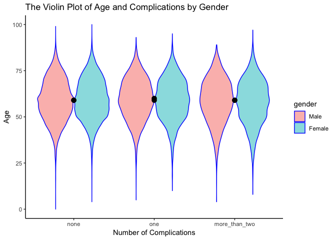

The Incidence Rate of Tuberculosis among People with Type II Diabetes in Shanghai, China
================
Rui Huang (rh2916) Hanbo Qiu (hq2163) Annie Yu (xy2404) Dana Zeng (dz2399) Coco Zou (xz2809)

Motivation
----------

Due to rapid urbanizations and lifestyle changes, Type II Diabetes (T2D) has become one of the most concerning public health issues in China. People with T2D are at risk of multiple complications including blindness, cardiovascular diseases, and becoming more susceptible to infectious diseases. As a result, researchers began to notice a higher tuberculosis (TB) incidence in the T2D positive population. Therefore, we would like to explore the incidence rate among people with diabetes and what potential risk factors contribute to this comorbidity, and hopefully, provide recommendations to control or decrease the prevalence of T2D and TB in China.

Related work
------------

In Qiu, Shi et al. (2017), a retrospective cohort study in Shanghai, China calculated the incident rate and identified risk factors for tuberculosis among patients with Type II Diabetes. We explored some variables which have proved to be related to the risk of tuberculosis based on this paper. Moreover, we browsed WHO website to collect the statistics about diabetes and tuberculosis and the End TB strategy.

Initial Questions
-----------------

We would like to investigate the incident rate of TB and its associates among adults with type 2 diabetes in Shanghai, China between 2004-2014, and geographical distribution of TB cases among people with diabetes. The potential factors would include gender, sociodemographic factors (i.e. age at diagnosis of T2D), clinical parameters (i.e.fasting glucose), complications of T2D, choice of antidiabetic medication, mode of exercises and geographical location. Most of these questions were answered in our project. Over the course of the project, we found taht it’s necessary to further analyze their interaction, like analyzing exercises distribution and glucose management odds ratios in different districts. Also, we came up with a new question that we might further explore the multilevel analysis on TB cases if more data was accessible. For example, we can analyze the individual, street and district levels respectively to check whether there is any difference in influencing the number of TB cases.

Data Source and Data Cleaning
-----------------------------

#### Diabetes Dataset Source

The diabetes data was from the Shanghai community-based diabetes management system (SCDMS), which was a diabetes register system operated by the Shanghai Municipal Centers for Disease Control and Prevention (Shanghai-CDC). Tuberculosis data was from Shanghai Municipal TB Surveillance System (SMTSS).SCDMS covers more than 25% of confirmed DM cases in Shanghai identified through the following approaches: community-based DM screenings, routine physical examinations and self-reporting. For confirmed DM cases, in-person interviews were conducted every 3 months after the initial assessment by CHC physicians to collect data on physical examination (including BMI and fasting blood glucose), complications, treatment modalities (categories and forms of medications used), lifestyle factors (including duration and intensity of physical activity in leisure time). The link to downlaod this dataset can be found [here](https://drive.google.com/open?id=1GPXa4-lAR7s1kYu0m6uMAxWKNmOVekh-).

#### Administrative Map Source

We obtained the administrative map from the [ArcGIS website](https://www.arcgis.com/home/item.html?id=105f92bd1fe54d428bea35eade65691b), since the administrative region of Shanghai is not included in the ggmap package. We converted the original shapefile to a data frame of longitude, latitude and administrative district. We joined this data frame to our data and showed the distribution of different parameters in each district. The link to downlaod this shipfile can be found [here](https://drive.google.com/open?id=1GPXa4-lAR7s1kYu0m6uMAxWKNmOVekh-).

#### Data cleaning

Renaming chinese variables in English and mutate vairables to desired format for data analysis

``` r
load('./dm.RData')
df_combine = dm_base %>% 
  rename(
    subject_id = JiBenCID,
    glu_average = fastglu, 
    weight_initial = tizhong_1st, 
    weight_average = tizhong, 
    height = ShenGao, 
    glu_initial = kfxt_1st,
    gender = xingbie,
    district = GuanLiQX,
    sys_pressure = Sbp,
    dia_pressure = Dbp,
    exercise_time = xiuxiansj,
    exercise = xiuxiantl,
    drug_insulin = insulin,
    drug_oral_sulfo = sulfonylurea,
    drug_oral_biguanide = biguanide,
    drug_oral_glu = glu_inhib,
    retina = reti, 
    skin = derm, 
    vessel = vesl, 
    nerve = neur,
    kidney = neph, 
    depression = depress,
    dmtime = quezhensj,
    birthyear  = birth_year,
    birthmon = birth_mon,
    dmdatayear = rucu_year,
    dmdatamon = rucu_mon,
    dmdataage = rucuage,
    drug_order = fuyaoqk) %>% 
  mutate(
    gender = factor(gender, labels = c("Male", "Female")),
    district = as.factor(district),
    glu_self_monitor = as.factor(celiangxtgl),
    bmi_initial = weight_initial/(height/100)^2, 
    bmi_average = weight_average/(height/100)^2, 
    bmi_change = bmi_average - bmi_initial,
    glu_change = glu_average - glu_initial,
    tb = as.factor(ifelse(censer == 1, "No", "Yes")),
    drug_oral_name  = case_when(drug_oral_sulfo == "1" & drug_oral_biguanide == "0" & drug_oral_glu == "0" ~"sulfonylurea",
                           drug_oral_biguanide == "1" & drug_oral_sulfo == "0" & drug_oral_glu == "0" ~ "biguanide",
                           drug_oral_glu == "1" & drug_oral_biguanide == "0" & drug_oral_sulfo == "0" ~ "glu_inhib",
                           drug_oral_sulfo == "1" & drug_oral_biguanide == "1" & drug_oral_glu == "0" ~"sulfonylurea&biguanide",
                           drug_oral_biguanide == "1" & drug_oral_sulfo == "0" & drug_oral_glu == "1" ~ "biguanide&glu_inhib",
                           drug_oral_sulfo == "1" & drug_oral_biguanide == "0" & drug_oral_glu == "1" ~"sulfonylurea&glu_inhib",
                           drug_oral_sulfo == "1" & drug_oral_biguanide == "1" & drug_oral_glu == "1" ~"sulfonylurea&glu_inhib&biguanide",
                           TRUE ~ "NA"),
    drug = drug_oral_biguanide + drug_oral_biguanide + drug_oral_glu + drug_insulin,
    retina = as.numeric(retina),
    skin = as.numeric(skin),
    vessel = as.numeric(vessel),
    nerve = as.numeric(nerve),
    kidney = as.numeric(kidney),
    complications = retina + skin + vessel + nerve + kidney + depression,
    complications = as.factor(complications),
    drug_order = as.factor(drug_order) ) %>% 
  mutate( exercise=as.character(exercise),
          exercise = fct_collapse(exercise, '1' = '1',  '2' = '2', '3' = c('3','4')),
          exercise = as.numeric(as.character(exercise))) %>% 
  select( -`_COL19`, -ZhiYe, -GuanLiJD, -ZhuZhiQX, -ZhuZhiJD, -JianCaQX, -JianCaJD) %>% 
  mutate(district = as.character(district),
         district = fct_collapse(district, Huangpu = '310101', Xuhui = '310104', Changning = '310105', Jingan = '310106', Putuo = '310107', Zhabei = '310108', Hongkou = '310109', Yangpu = '310110', Minhang = '310112', Baoshan = '310113',  Pudong = c('310115', '310119'), Jiading = '310114', Jinshan = '310116', Songjiang = '310117', Qingpu = '310118', Fengxian = '310120', Chongming = '310230')) %>% 
  mutate(glu_self_monitor = fct_collapse(glu_self_monitor, Yes = '1', No = as.character(c(2:3))))

#save(df_combine,file = './data/df_combine.RData')
```

Converting shapefiles to data frame and join to the parameter data frame.

``` r
sh <- readOGR('data/shanghai_shapefile/shang_dis_merged.shp',verbose = F)
sh@data <- sh@data %>% 
  mutate(Name = as.factor(Name)) %>%
  mutate(Name = fct_recode(Name, Jiading = '嘉定区',
                           Fengxian = '奉贤区',
                           Baoshan = '宝山区',
                           Chongming = '崇明县',
                           Xuhui = '徐汇区',
                           Putuo ='普陀区',
                           Yangpu = '杨浦区',
                           Songjiang = '松江区',
                           Pudong='浦东新区',
                           Hongkou = '虹口区',
                           Jinshan = '金山区',
                           Changning = '长宁区',
                           Minhang = '闵行区',
                           Zhabei = '闸北区',
                           Qingpu = '青浦区', 
                           Huangpu = '黄浦区'))
sh_df <- broom::tidy(sh, region='Name')
sh_df <- sh_df %>%
  mutate(urban = as.factor(id))%>% 
  mutate(urban = fct_collapse(urban, 
                              Urban = c('Changning','Hongkou','Huangpu','Putuo','Xuhui','Yangpu','Zhabei'),
                              Suburban =  c('Baoshan','Jiading','Jinshan','Minhang','Chongming','Qingpu','Songjiang','Fengxian'),
                              Pudong__New_District = 'Pudong'))
x <- df_combine %>% 
  filter(district != "") %>% 
  mutate(tb = fct_recode(tb, '1'= 'Yes', '0'='No'),
         tb=as.character(tb),
         tb=as.numeric(tb),
         district = as.character(district),
         district = fct_collapse(district, Huangpu = '310101', Xuhui = '310104', Changning = c('310105', '310106'), Putuo = '310107', Zhabei = '310108', Hongkou = '310109', Yangpu = '310110', Minhang = '310112', Baoshan = '310113',  Pudong = c('310115', '310119'), Jiading = '310114', Jinshan = '310116', Songjiang = '310117', Qingpu = '310118', Fengxian = '310120', Chongming = '310230'),
         exercise = as.numeric(as.character(exercise)),
         complications = as.numeric(as.character(complications)))%>% 
  group_by(district) %>% 
  summarise(TB_Total = sum(tb),
            TB_Incidence = TB_Total/n(),
            Exercise_Frequency = mean(exercise),
            Complications = mean(complications),
            BMI_Change = mean(bmi_change,na.rm = T),
            Glucose_Average = mean(glu_average),
            Glucose_Measure_Frequency = mean(celiangxtgl),
            Medication = mean(drug)) %>% 
  rename(id = district)

sh_df <- sh_df %>% 
  inner_join(x,by='id') %>% 
  gather(TB_Total:Medication, key=parameter, value=value)

#write.csv(sh_df,'data/sh_df.csv')
```

Exploratory analysis
--------------------

After the first step of analysis of the data set, we decided to mainly focus on four main risk factors: glucose level, drug usage level, complications level, and daily exercise level. When doing the analysis, for each risk factors, we looked for the different distributions of different levels by gender, by district, and by age. Because we are investigating the incidence of tuberculosis among Type II diabetes patients, we also analyzed the odds of tuberculosis in different levels of risk factors. We have explored histograms, density plot and odds ratio comparing plot to analyze different distributions. Our final result is shown in the K-M survival plot, which will be discussed later.

### Descriptive Statistics for TB Incidence

Calculating the total person-years and subsetting the data by gender and calculating incidence rate separately.

``` r
df_descrip = df_combine %>% 
  filter(district != "") %>% 
  mutate(tb = fct_recode(tb, '1'= 'Yes', '0'='No')) %>% 
  mutate(tb=as.character(tb),
         tb=as.numeric(tb)) 

# person_years

mean_follow_up_year = mean(df_descrip$days)/365
sum_follow_up_year = sum(df_descrip$days)/365

# tb summary
sum_tb = sum(df_descrip$tb)


# overall incidence
overall_incidence = sum_tb/sum_follow_up_year

# male incidence
df_male = df_descrip %>% filter(gender == 'Male')
male_incidence = sum(df_male$tb)/(sum(df_male$days)/365)

# female incidence
df_female = df_descrip %>% filter(gender == 'Female')
female_incidence = sum(df_female$tb)/(sum(df_female$days)/365)
```

With an average following-up period of 3.8440697 year (range: 0 to 10.9616438 years, 785 TB cases were recorded among 170381 T2DM patients from 6.549564310^{5} person-years follow-up. The overall incident rate of TB was 119.8553004 per 100 000 person-years with 224.2033743 per 100 000 person-years for men, and 51.3442211 per 100 000 person-years for women.

### Glucose Management And TB Incidence Analysis

Grouping the data by district, and calculatiing the OR and CI for each district.

``` r
df_combine%>% 
  mutate(urban_rural = as.factor(urban_rural)) %>% 
  filter(!is.na(district), !district %in% c("Xuhui", "Qingpu", "Jiading",'310119','')) %>% 
  group_by(district) %>% 
  nest() %>% 
  mutate(models = map(data, ~glm(tb ~ gender + dmage + glu_self_monitor, data = .x, family = binomial())),
         ci = map(.x=models, ~confint(.x)),
         or = map(models, broom::tidy),
         ci = map(ci, broom::tidy)) %>% 
  select(-data,-models) %>% 
  unnest() %>% 
  filter(term == "glu_self_monitorNo") %>% 
  select(district, or = estimate, ci_low = "X2.5..", ci_high = "X97.5..") %>% 
  mutate(or = exp(or), ci_low = exp(ci_low), ci_high = exp(ci_high), district = fct_reorder(district, or)) %>% 
  ggplot(aes(x = district, y = or)) + 
  geom_point() + 
  geom_errorbar(aes(ymin = ci_low, ymax = ci_high)) +
  labs(
    title = "The estimated ORs and CIs for district in Shanghai",
    x = "District",
    y = "The estimated ORs and CIs"
  ) +
  theme(axis.text.x = element_text(angle = 45, hjust = 1)) +
  theme_classic()+
  scale_y_continuous(limits=c(0, 4))
```


We explored whether diabetes who regularly monitor glucose can reduce the risk of having TB in urban or rural areas. For each district in Shanghai, we obtained the estimate and confidence interval of the adjusted odds ratio for having TB comparing diabetes who regularly monitor glucose to those who don't monitor glucose regularly keeping all other variables fixed. The results show Huangpu district has the highest OR and Baoshan district has the lowest OR.

### Initial BMI

Visualizing the gender and initial\_BMI by TB ststus.

``` r
df_combine %>% 
  ggplot(aes(x = gender, y = bmi_initial, fill = tb)) +
  geom_boxplot() +
  ylab('Initial_BMI_Level')+
  xlab('gender')+
  theme_classic()+
  scale_y_continuous(limits=c(0, 40))
```


This plots shows the range of initial glucose level of different genders. The red box represents the individuals without tuberculosis while the green box represents the ones who have the disease. The median and the third quartiles of the initial glucose level are higher in TB individuals than those of samples without TB.

### Drug Usage Level

Visualizing the total observation of each drug level by gender

``` r
df_drug = df_combine %>% 
  select(contains("drug"),censer,urban_rural,dmage,gender) 

plot_names_2 <- c("1" = "Urban", "2" = "Rural")

p2 <- df_drug %>% 
  ggplot(aes(x = drug))+geom_histogram(color="black", fill='blue', alpha=.5)+
  facet_grid(~factor(gender)) + 
  viridis::scale_fill_viridis(discrete = TRUE)+
  theme_classic()+
  labs(
    x = "Drug Level",
    y = "Number of People"
  )

p2
```


This drug plot is showing that among all the people with Type II diabetes, Females are more likely to following medical orders to take medicines. The x axis shows the kinds of medicine that drug using, while y axis is the number of people.

### Complications Level

Visualizing number of complications and age by gender

``` r
df_complication <- df_combine %>% 
  mutate(retina = as.numeric(retina),
         skin = as.numeric(skin),
         vessel = as.numeric(vessel),
         nerve = as.numeric(nerve),
         kidney = as.numeric(kidney)) %>% 
  mutate(complications = retina + skin + vessel + nerve + kidney + depression) %>%
  mutate(complications = as.character(complications),
         complications = fct_collapse(complications, none='0',one='1',more_than_two= as.character(c(2:6))))

ggplot(df_complication, aes(x = complications, y = dmage, hue = gender)) + 
  geom_violin(aes(fill = gender), color = "blue", alpha = .5) + 
  stat_summary(fun.y = median, geom = "point", color = "black", size =3)+
  xlab('Number of Complications')+
  ylab('Age')+
  theme_classic()+
  ggtitle('The Violin Plot of Age and Complications by Gender')
```



This plot shows the number of complications among poeple with Type II Diabetes in different ages and different genders. The Y axis shows age while X axis shows the number of complications that each sample has. We could see that number of complications is similar distributed among participants from different age and different gender.

### Daily Exercise Level

Visualizing how exercise change across age by city/suburb status

``` r
df_exercise = df_combine %>% 
  mutate(exercise = as.numeric(exercise),
         total_exercise = exercise * exercise_time,
         gender = as.factor(gender),
         urban_rural = ifelse(urban_rural== 1, "Urban", "Rural"))

plot_exer = df_exercise %>% 
  group_by(gender, urban_rural, dmage) %>% 
  summarize(total_exercise = mean(total_exercise)) %>% 
  ungroup() %>% 
  ggplot(aes(x = dmage, y =total_exercise, color=urban_rural)) +
  geom_line() +
    labs(title="The average exercise vs age",
         x = "Age",
         y = "Exercise")+
  theme_classic() 

plot_exer
```


This plots shows the distribution of exercise amount along with different ages. Between age 25 to 80, which represents the most of samples, people from rural district has more exercise amout than urban people. The noise within below 25 range and above 80 range is probabily because the number of samples from these two ranges are too small to show a trend.

### Geo Analysis

We further created a shiny app to display different paramter distributions in each district in Shanghai with an intuitional geographical visualization. For example, how many total TB cases are in each district, are they suburban or urban districts, etc. The parameters include: TB\_Total, TB\_incidence,Exercise\_Frequency,Complications,BMI\_Change,Glucose\_Average,Glucose\_Measure\_Frequency, and Medication. The map is showed by shiny, which can be reached at [here](https://danazenggg-p8105.shinyapps.io/geo_analysis_goodtogo/). The code we used is shown below:

##### Shiny App code for Administrative Map of Shanghai and Geo-Analysis

``` r
sh_df <- read.csv('data/sh_df.csv')
### Making two plotly shanghai maps
map1 <- sh_df %>%
      rename(District = id) %>%
      filter(parameter=='TB_Total') %>%
      ggplot()+
      geom_polygon(aes(x = long, y = lat, group = group,fill=District),alpha=.5,
                   colour = "black")+
      scale_alpha_manual( guide = "none")+
      theme_bw()+
      facet_wrap(~'District' )
map2 <- sh_df %>%
      filter(parameter=='TB_Total') %>%
      mutate(urban = fct_recode(urban, City = 'Urban', Suburb = 'Suburban', Pudong = 'Pudong__New_District')) %>% 
      rename(City_or_Suburb = urban) %>%
      ggplot()+
      geom_polygon(aes(x = long, y = lat, group = group,fill=City_or_Suburb),alpha=.5,
                   colour = "black")+
      scale_alpha_manual( guide = "none")+
      theme_bw()+
      facet_wrap(~'City/Suburb' )

maps <- subplot(style(map1, showlegend = FALSE),style(map2, showlegend = F),
                margin = 0.05,titleX = F,titleY = F)
maps


## Code for the shiny panel
choice=  sh_df %>% distinct(parameter) %>% pull()

 sidebarLayout(

     sidebarPanel(
       inputPanel(radioButtons("Parameter", label = h3("Parameters"),
                 choices = choice, selected = "TB_Total")
 )

     ),

     # Show a plot of the generated distribution
     mainPanel(
       renderPlotly({
     map <- sh_df%>%
       rename(District = id) %>%
       filter(parameter == input$Parameter) %>%
       ggplot()+
       theme_bw()+
       geom_polygon(aes(x = long, y = lat, group = group,fill=value),alpha = .5,
                    colour = "black")
     ggplotly(map)
       }
     )
   )
 )
```

Additional analysis
-------------------

### Cox Regression

Mutating variables to desired classes fitting them to the Cox Model

``` r
df_cox <- df_combine %>% 
  mutate(age = 2018-as.numeric(birthyear)) %>% 
  mutate(complications = as.numeric(complications)) %>% 
  mutate(exercise = as.numeric(exercise))

cox <- coxph(Surv(days, censer) ~ complications+gender+exercise+age+drug, data =df_cox)
```

##### The global test statistic is given by:

``` r
broom::glance(cox) %>%
  select(statistic.log,p.value.log,statistic.sc,p.value.sc,statistic.wald,p.value.wald,r.squared) %>% 
  knitr::kable(digits = 3)
```

|  statistic.log|  p.value.log|  statistic.sc|  p.value.sc|  statistic.wald|  p.value.wald|  r.squared|
|--------------:|------------:|-------------:|-----------:|---------------:|-------------:|----------:|
|       4901.174|            0|      4775.888|           0|         4769.39|             0|      0.028|

##### The summary of Cox Regression

``` r
broom::tidy(cox) %>% 
  mutate(exp_estimate = exp(estimate)) %>% 
  select(term,exp_estimate, std.error, statistic, p.value) %>% 
knitr::kable(digits = 3)
```

| term          |  exp\_estimate|  std.error|  statistic|  p.value|
|:--------------|--------------:|----------:|----------:|--------:|
| complications |          0.821|      0.005|    -37.852|    0.000|
| genderFemale  |          0.919|      0.005|    -17.172|    0.000|
| exercise      |          0.818|      0.005|    -37.195|    0.000|
| age           |          0.999|      0.000|     -2.226|    0.026|
| drug          |          0.909|      0.002|    -40.007|    0.000|

We fitted the Cox regression with covariates of complications, exercise, age, drug, complications, and gender. The p-value for all three overall tests (likelihood, Wald, and score) are significant, indicating that the model is significant. These tests evaluate the omnibus null hypothesis that all of the betas are 0, and therefore the omnibus null hypothesis is soundly rejected.

In the multivariate Cox analysis, the all covariates remain significant (p &lt; 0.05). The p-value for exercise is less than 2e-16, with a hazard ratio HR = exp(coef) = 0.818, indicating a relationship between the exercise status and decreased risk of death. When holding the other covariates constant, exercising more than 2 hours a week (exercise=3) reduces the hazard by nearly 20%. We conclude that exercising more than 2 hours a week is associated with good prognostic. The p-value for gender is less than 2e-16, with a hazard ratio HR = exp(coef) = 0.919, indicating a relationship between the patients’ sex and decreased risk of death. When holding the other covariates constant, being female (sex=2) reduces the hazard by nearly 8%. We conclude that being female is associated with good prognostic. The p-value for the drug is less than 2e-16, with a hazard ratio HR = exp(coef) = 0.909, indicating a relationship between the number of antidiabetic drugs that the patient takes and decreased risk of death. When holding the other covariates constant, taking four antidiabetic medications (drug=4) reduces the hazard by nearly 10%. We conclude that taking antidiabetic medication is associated with good prognostic.

### Survival Analysis

To further visualize how different risk factors affect the time of getting TB among T2DM people, we used Kaplan-Meier estimator to estimate the survival function and drew Kaplan–Meier survival curves. In this function, the event is developing TB. From the curve, gender and drug have effects on the probability of getting TB while exercise and complication have no significant effect. The result is showed by shiny, and the output can be reached at [here](https://dmvstb.shinyapps.io/survivalanalysis/) .

##### The code is shown below:

``` r
library(flexdashboard)
library(shiny)
library(p8105.datasets)
library(plotly)
library(tidyverse)
library(viridis)
library(survivalAnalysis)
library(survminer)
library(survival)
library(flexdashboard)
library(dplyr)

### Getting the parameters for widgets
load('./df_combine.RData')

df_combine<-df_combine %>% 
  mutate(district = as.character(district),
         district = fct_collapse(district, Huangpu = '310101', 
                                 Xuhui = '310104', Changning = c('310105', '310106'), 
                                 Putuo = '310107', Zhabei = '310108', 
                                 Hongkou = '310109', Yangpu = '310110', 
                                 Minhang = '310112', Baoshan = '310113',  
                                 Pudong = c('310115', '310119'), Jiading = '310114', 
                                 Jinshan = '310116', Songjiang = '310117', 
                                 Qingpu = '310118', Fengxian = '310120', 
                                 Chongming = '310230'))

risk_vectors <- c("By Gender","By Drug Level",
                  "By Complications Level","By Exercise Level")
district_vectors <- c("Huangpu", "Xuhui", "Changning","Putuo","Zhabei","Hongkou",
                      "Yangpu","Minhang","Baoshan","Pudong","Jiading","Jinshan","Songjiang",
                      "Qingpu","Fengxian","Chongming")


# Defining the widges 
ui <- fluidPage(
   
   # Application title
   titlePanel("K-M analysis"),
   sidebarPanel(
     selectInput("risk_factor", label = h3("Risk Factors"),
                 choices = risk_vectors, selected = "Manhattan"),
     
     selectInput("district_factor", label = h3("District"),
                 choices = district_vectors, selected = "Huangpu"),
 
     sliderInput("age_range", label = h3("Choose age range"), min = 1, 
                 max = 100, value = c(10, 100))
   ),
   mainPanel(
     plotOutput('plot1')
   )
   
)

# generating the interactive KM-plots
server <- function(input, output) {
  
  
  output$plot1 <- renderPlot(
    
    if(input$risk_factor=="By Gender"){
      df_combine %>%
        filter(district == input$district_factor,
               dmage %in% input$age_range[1]:input$age_range[2]) %>% 
        mutate(tb = fct_recode(tb, '1'= 'Yes', '0'='No'),
               tb=as.character(tb),
               tb=as.numeric(tb)) %>% 
        analyse_survival(vars(days, tb), by=gender) %>% 
        kaplan_meier_plot(ylim=c(0.975,1),break.time.by = 300)
    }else if(input$risk_factor=="By Drug Level"){
      df_combine %>%
        filter(district == input$district_factor,
               dmage %in% input$age_range[1]:input$age_range[2]) %>% 
        mutate(tb = fct_recode(tb, '1'= 'Yes', '0'='No'),
               tb=as.character(tb),
               tb=as.numeric(tb)) %>% 
        analyse_survival(vars(days, tb), by=drug) %>% 
        kaplan_meier_plot(ylim=c(0.975,1),break.time.by = 300)
    }else if(input$risk_factor=="By Complications Level"){
      df_combine %>%
        filter(district == input$district_factor,
               dmage %in% input$age_range[1]:input$age_range[2]) %>% 
        mutate(tb = fct_recode(tb, '1'= 'Yes', '0'='No'),
               tb=as.character(tb),
               tb=as.numeric(tb)) %>% 
        analyse_survival(vars(days, tb), by=complications) %>% 
        kaplan_meier_plot(ylim=c(0.975,1),break.time.by = 300)
    }else if(input$risk_factor=="By Exercise Level"){
      df_combine %>%
        filter(district == input$district_factor,
               dmage %in% input$age_range[1]:input$age_range[2]) %>%  
        mutate(tb = fct_recode(tb, '1'= 'Yes', '0'='No'),
               tb=as.character(tb),
               tb=as.numeric(tb)) %>% 
        analyse_survival(vars(days, tb), by=exercise) %>% 
        kaplan_meier_plot(ylim=c(0.975,1),break.time.by = 300)
    }
  )
}

# Run the application 
shinyApp(ui = ui, server = server)
```

Discussion:
-----------

In this project, we explored how covaraites predicted the survival rate by conducting a Cox regression and constructing Kaplan–Meier curves as the main reult, in addition to a geo-analytics as a by-product. Among males, the incident rate of TB was 224.207 per 100 000 person-years while for female the incident rate is 51.345 per 100 000 person-years. We fitted the Cox regression with covariates of complications, exercise, age, drug, and gender. The p-value for all three overall tests (likelihood, Wald, and score) were significant, indicating that the model was significant and all the factors matters in the model, which is consistant with our expectations. From Kaplan-Meier survival curves, we found that genders, drug levels and exercises levels had significant effects on the probability of getting TB while complications had no significant effect.

Conclusion:
-----------

Our result indicates that males with Type II Diabetes are more likely to have tuberculosis than fameles. Compliance to the medication prescription, increased exercise and keeping a good BMI status would decrease the probability of having tuberculosis. We hope this result could provide insights and perspectives to decrease the prevalence of tuberculosis among people with Type II Diabetes in Shanghai, China.
